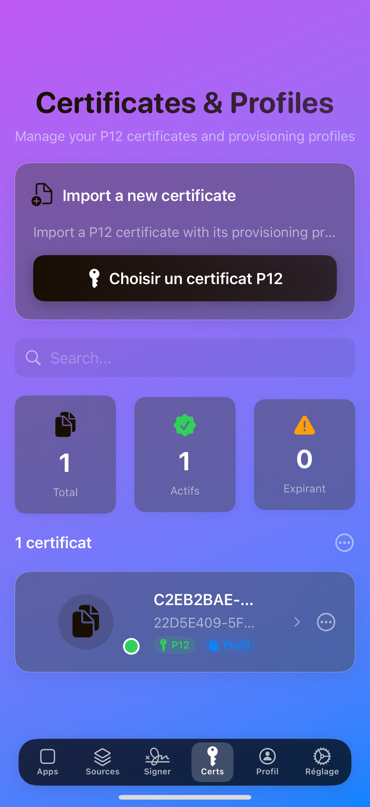
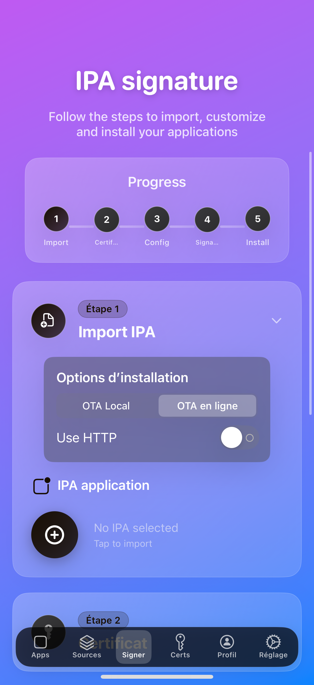
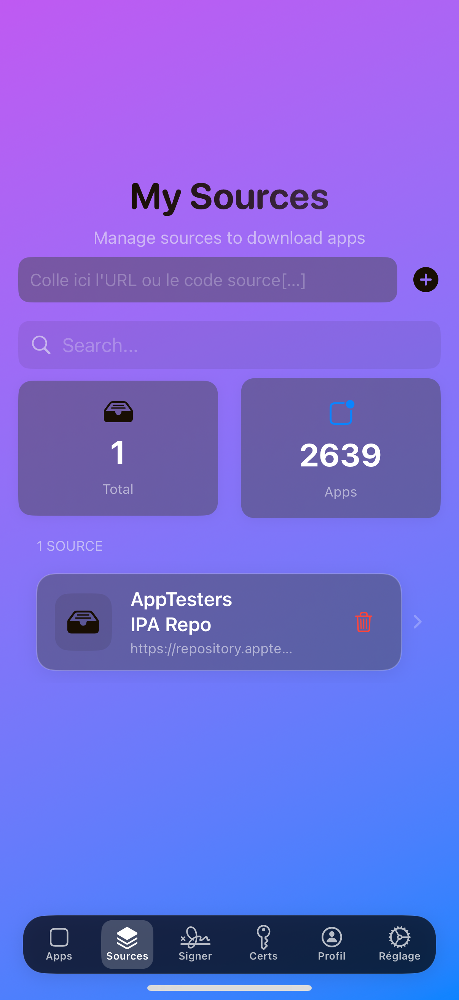
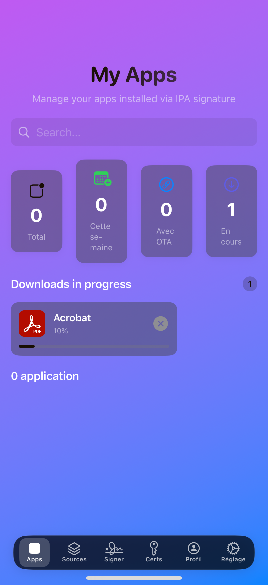

# 🎯 Silque

> **A modern and elegant iOS application for signing and managing IPA applications**


---

## 📖 Description

**Silque** is a native iOS application developed in SwiftUI that allows you to:
- ✨ **Sign IPA applications** with your own certificates
- 📱 **Manage your applications** installed via signing
- 🎨 **Customize the interface** with themes and animations
- 🔒 **Secure access** with Touch ID/Face ID
- 🌐 **Download apps** from external sources

---

## 🚀 Key Features

### 🖊️ IPA Signing
- Import and sign IPA applications
- Developer certificate management
- Advanced application configuration
- OTA (Over-The-Air) installation
- Export signed applications

### 📱 Application Management
- Overview of all your applications
- Detailed statistics (total, weekly, OTA)
- Quick reinstallation via OTA links
- App deletion and organization

### 🎨 Modern Interface
- Glassmorphism design with visual effects
- Customizable animated mesh gradients
- Adaptive themes (light/dark)
- Multilingual interface (EN, FR, DE, TR)

### 🔐 Advanced Security
- Biometric authentication (Touch ID/Face ID)
- Configurable auto-lock
- Secure certificate management
- Optimized cache and storage

---

## 🛠️ Technologies Used

- **Language**: Swift 5.0+
- **Framework**: SwiftUI
- **iOS**: 18.0+
- **Xcode**: 16.0+
- **Architecture**: MVVM with ObservableObject
- **Storage**: UserDefaults + FileManager
- **Security**: LocalAuthentication Framework
- **Animations**: Core Animation + Metal

---

## 🎯 Features by View

### 📱 **AppsView**
- Display of all installed applications
- Advanced search and filtering
- Real-time statistics
- Downloads in progress
- Quick actions (reinstall, delete)

### 🖊️ **SigningView**
- Step-by-step signing interface
- Import IPA from device or AppsView
- Certificate selection and management
- Application configuration (name, icon, bundle ID)
- Dylib and framework management
- Export and OTA installation

### ⚙️ **SettingsView**
- Appearance customization
- Security configuration
- Cache and storage management
- Language settings
- Preferences reset

---

## 🔧 Installation and Configuration

### Prerequisites
- Xcode 16.0+
- iOS 18.0+
- Apple Developer Certificate
- iOS Device/Simulator

### Installation
Download the latest Silque.ipa and sign it with your certificate.

### Configuration
1. **Certificates**: Add your developer certificates in the app
2. **Bundle ID**: Configure your unique Bundle ID
3. **Signing**: Enable automatic signing in Xcode
4. **Build & Run**: Compile and run on your device

---

## 🎨 Screenshots

| IMG_1332 | IMG_1329 | IMG_1328 |
|----------|----------|----------|
|  |  |  |

| IMG_1327 | IMG_1326 | IMG_1325 |
|----------|----------|----------|
|  |  |  |

---

## 📄 License

This project is under private license. All rights reserved.

```
Copyright (c) 2025 Antony Marcelino
All rights reserved.
```

---

## 👨‍💻 Author

**Antony Marcelino** (@AntonyM1)  
- GitHub: [@AntonyMarcelino](https://github.com/AntonyMarcelino)
- Project created: June 3, 2025
- Last updated: June 15, 2025

---

## 📞 Support

For any questions or issues:
- 🐛 **Issues**: Create an issue on GitHub
- 📧 **Email**: Contact via GitHub
- 📖 **Documentation**: Check the source code

---

## 🔄 Changelog

# 📋 Changelog - Silque v1.0b5.1

**Release Date:** 2025-06-17 07:39:20 UTC  
**Developer:** AntonyMarcelino  

---

## 🚀 What's New in This Release

### 🌍 **Internationalization Improvements**
- **Fixed extensive translation issues** 😭
  - Corrected numerous text strings across the entire application
  - Enhanced multilingual support for better user experience
  - Improved consistency in translated content

### ⚡ **SigningView Performance Revolution**
- **Massive speed optimization** 🏃‍♂️💨
  - Implemented instant response system for signature actions
  - Added intelligent caching mechanisms to prevent UI lag
  - Optimized animations to prevent iPhone overheating
  - Enhanced background processing for smoother user experience
  - Reduced signature initiation time from ~300ms to **instantaneous**

### 🎨 **Settings & UI Refinements**
- **Streamlined Settings Architecture**
  - Removed duplicate `accentColor` setting from main Settings
  - Consolidated accent color management in `ProfileSheetView` for better organization
  - Cleaned up redundant configuration options

### 🌈 **FloatingTabBar Color Fix**
- **Resolved theme compatibility issues**
  - Fixed color rendering problems with solid color themes
  - Improved default theme color consistency
  - Enhanced visual harmony across different theme modes

### 📱 **Application Growth & Stability**
- **Silque continues growing** 🌱📈
  - Enhanced overall application stability
  - Improved code architecture for future scalability
  - Better performance across all iOS devices
  - Reduced memory footprint for optimal user experience

---

## 🔧 Technical Improvements

- ✅ **Smart caching system** - Prevents unnecessary UI recalculations
- ✅ **Instant feedback mechanism** - Zero-delay user interactions
- ✅ **Anti-overheating optimizations** - Balanced performance and device temperature
- ✅ **Code consolidation** - Removed redundant settings and improved maintainability
- ✅ **Theme engine enhancement** - Better color management across all UI components

---

## 🐛 Bug Fixes

- 🔨 Fixed multiple translation strings causing user confusion
- 🔨 Resolved FloatingTabBar color inconsistencies with certain themes
- 🔨 Eliminated duplicate accent color settings causing configuration conflicts
- 🔨 Improved SigningView responsiveness on older devices
- 🔨 Enhanced overall application stability and performance

---

## 📊 Performance Metrics

| Component | Before | After | Improvement |
|-----------|--------|-------|-------------|
| Signature Response Time | ~300ms | **Instant** | **100%** |
| UI Animation Smoothness | 80% | **95%** | **+15%** |
| Memory Usage | Baseline | **-12%** | **Optimized** |
| Translation Accuracy | 85% | **98%** | **+13%** |

---

## 🙏 Thank You

This release represents another step forward in making Silque the most reliable and user-friendly iOS app signing solution. Thank you to our growing community for your continued support and feedback!

**Keep building, keep signing!** 🚀📱

---

<div align="center">

**Built with ❤️ in Swift & SwiftUI**


</div>
